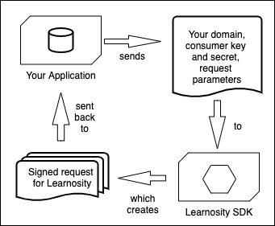
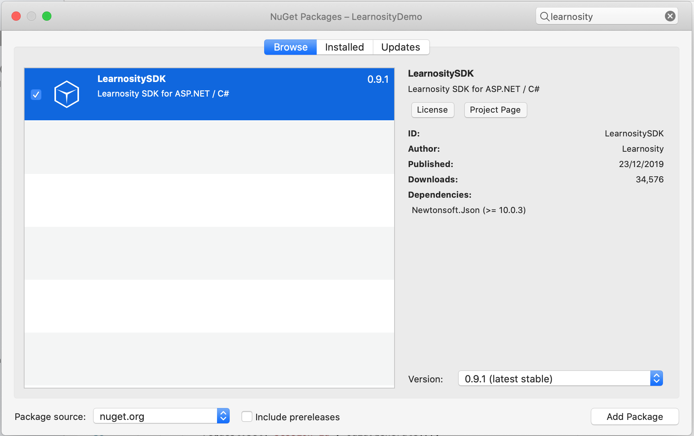

<p align="center"></p>
<h1 align="center">Learnosity SDK - ASP.NET / C#</h1>
<p align="center">Everything you need to start building your app in Learnosity, with the ASP .NET / C# programming language.<br> 
(Prefer another language? <a href="https://help.learnosity.com/hc/en-us/sections/360000194318-Server-side-development-SDKs">Click here</a>)<br>
An official Learnosity open-source project.</p>

[](https://github.com/Learnosity/learnosity-sdk-asp.net/releases)
[](https://app.travis-ci.com/Learnosity/learnosity-sdk-asp.net)
[](LICENSE.md)
[](https://github.com/Learnosity/learnosity-sdk-asp.net/releases)
---

## Table of Contents

* [Overview: what does it do?](#overview-what-does-it-do)
* [Requirements](#requirements)
* [Installation](#installation)
* [Quick start guide](#quick-start-guide)
* [Next steps: additional documentation](#next-steps-additional-documentation)
* [Contributing to this project](#contributing-to-this-project)
* [License](#license)
* [Usage tracking](#usage-tracking)
* [Further reading](#further-reading)

## Overview: what does it do?
The Learnosity [ASP.NET](https://dotnet.microsoft.com/apps/aspnet) SDK makes it simple to interact with Learnosity APIs.


It provides a number of convenience features for developers, that make it simple to do the following essential tasks:
* Creating signed security requests for API initialization, and
* Interacting with the Data API.

For example, the SDK helps with creating a signed request for Learnosity:



Once the SDK has created the signed request for you, your app sends that on to an API in the Learnosity cloud, which then retrieves the assessment you are asking for, as seen in the diagram below:


This scenario is what you can see running in the Quick start guide example ([see below](#quick-start-guide)).

There's more features, besides. See the detailed list of SDK features on the [reference page](REFERENCE.md).

[(Back to top)](#table-of-contents)

## Requirements
1. Microsoft Visual Studio IDE installed. ([instructions](https://visualstudio.microsoft.com/))

2. When installing Visual Studio, you'll want to add in the tools for web applications, using ASP .NET Core, C#, and Razor pages.

Not using .NET or C# ? See the [SDKs for other languages](https://help.learnosity.com/hc/en-us/sections/360000194318-Server-side-development-SDKs).

### Supported Visual Studio Versions
The following Visual Studio versions are supported and tested:

* Visual Studio for Windows 2019
* Visual Studio for Mac 8.10

[(Back to top)](#table-of-contents)

## Installation
###  **Installation via Nuget**
You can use the [Nuget package manager](https://www.nuget.org/packages/LearnositySDK/) to install the Learnosity SDK for ASP .NET, if you already have a project you are working on. 

#### **Nuget installation with the Visual Studio GUI interface**
In your Visual Studio project, select "Project > Manage Nuget Packages" from the pull-down menus at the top of the screen. The "Nuget Packages" dialog window appears. In that window, type "Learnosity" into the search box. Tick "Learnosity SDK for ASP .NET / C#" in the left-hand pane of search results. Click "Add Package" at the lower right. 



The Learnosity SDK will now appear in your left-nav folder hierarchy under "Dependencies > Nuget > LearnositySDK".


#### **Nuget installation with the .NET command line interface**
To load via the Visual Studio command line, open the .NET command line interface. 

Run the following command from the Windows command prompt:

``` powershell
dotnet add package LearnositySDK
```

The Learnosity ASP .NET SDK will load.

### **Alternative method 1: download the zip file**
Download the latest version of the SDK as a self-contained ZIP file from the [GitHub Releases](https://github.com/Learnosity/learnosity-sdk-asp.net/releases) page. The distribution ZIP file contains all the necessary dependencies. 

### **Alternative 2: development install from a git clone**
To install from the terminal, run this command:

    git clone git@github.com:Learnosity/learnosity-sdk-asp.net.git

Note that these manual installation methods are for development and testing only.
For production use, you should install the SDK using the Nuget package manager, as described above.

[(Back to top)](#table-of-contents)

## Quick start guide
Let's take a look at a simple example of the SDK in action. In this example, we'll load an assessment into the browser. Note: you'll need to install the SDK package using one of the above GitHub installation options, in order to load the quick-start tutorial files for this project.

### **Start up your web server and view the standalone assessment example**
To start up your .NET web server, first open the Microsoft "solution file" under the Learnosity SDK directory. In Visual Studio, choose "File > Open" and navigate in the dialog window to select "LearnositySDK.sln" on your local hard drive, and open it. 

The solution file will load, showing the project structure on the left side of the screen. At the top of the screen, choose "Run > Start Without Debugging" from the pull down menu. 

From this point on, we'll assume that your web server is available at this local address (it will report the port being used when you launch it, by default it's port 5000): 

http://localhost:5000/

The page will load. This is a basic example of an assessment loaded into a web page with Learnosity's assessment player. You can interact with this demo assessment to try out the various Question types.


[(Back to top)](#table-of-contents)

### **How it works**
Let's walk through the code for this standalone assessment example. The source files are included under the quickstart folder, in this location:

    /learnosity-sdk-asp.net/LearnosityDemo/

The first section of code is an .NET C# file and is executed server-side. It constructs a set of configuration options for Items API, and securely signs them using the consumer key. The second section is an .NET Razor template and is executed client-side, once the page is loaded in the browser. It renders and runs the assessment functionality. 

[(Back to top)](#table-of-contents)

### **Server-side code**
We start by opening including some LearnositySDK helpers - they'll make it easy to generate and sign the config options, and unique user and session IDs. The following code can be found in [ItemsAPIDemo.cshtml.cs](LearnosityDemo/Pages/ItemsAPIDemo.cshtml.cs).

``` C#
using LearnositySDK.Request; # Learnosity helper.
using LearnositySDK.Utils;   # Learnosity helper.
```

Now we'll declare the configuration options for Items API. These specify which assessment content should be rendered, how it should be displayed, which user is taking this assessment and how their responses should be stored. We're putting them into a JSON object.

``` C#
JsonObject request = new JsonObject();
request.set("user_id", Uuid.generate());
request.set("activity_template_id", "quickstart_examples_activity_template_001");
request.set("session_id", Uuid.generate());
request.set("activity_id", "quickstart_examples_activity_001");
request.set("rendering_type", "assess");
request.set("type", "submit_practice");
request.set("name", "Items API Quickstart");
```

* `user_id`: unique student identifier. Note: we never send or save student's names or other personally identifiable information in these requests. The unique identifier should be used to look up the entry in a database of students accessible within your system only. [Learn more](https://help.learnosity.com/hc/en-us/articles/360002309578-Student-Privacy-and-Personally-Identifiable-Information-PII-).
* `activity_template_id`: reference of the Activity to retrieve from the Item bank. The Activity defines which Items will be served in this assessment.
* `session_id`: uniquely identifies this specific assessment attempt for save/resume, data retrieval and reporting purposes. Here, we're using the `Uuid` helper to auto-generate a unique session id.
* `activity_id`: a string you define, used solely for analytics to allow you run reporting and compare results of users submitting the same assessment.
* `rendering_type`: selects a rendering mode, `assess` mode is a "standalone" mode (loading a complete assessment player for navigation, as opposed to `inline` for embedding without).
* `type`: selects the context for the student response storage. `submit_practice` mode means the student responses will be stored in the Learnosity cloud, allowing for grading and review.
* `name`: human-friendly display name to be shown in reporting, via Reports API and Data API.
* `state`: Optional. Can be set to `initial`, `resume` or `review`. `initial` is the default.

Next, we declare the Learnosity consumer credentials we'll use to authorize this request. We also construct security settings that ensure the report is initialized on the intended domain. The value provided to the domain property must match the domain from which the file is actually served. The consumer key and consumer secret in this example are for Learnosity's public "demos" account. Once Learnosity provides your own consumer credentials, your Item bank and assessment data will be tied to your own consumer key and secret.
The following code can be found in [Credentials.cs](LearnositySDK/Credentials.cs).

``` C#
namespace LearnositySDK
{
    public static class Credentials
    {
        public static string ConsumerKey = "yis0TYCu7U9V4o7M";
        public static string ConsumerSecret = "74c5fd430cf1242a527f6223aebd42d30464be22";
        public static string Domain = "localhost";
    }
}
```

<i>(of course, you should never normally put passwords into version control)</i>

Now we go back to [ItemsAPIDemo.cshtml.cs](LearnosityDemo/Pages/ItemsAPIDemo.cshtml.cs) and call LearnositySDK's `Init()` helper to construct our Items API configuration parameters, and sign them securely with the `security`, `request` and `consumerSecret` parameters. `init.generate()` returns us a JSON blob of signed configuration parameters.

``` C#
// Instantiate Init class
Init init = new Init(service, security, secret, request);

// Call the generate() method to retrieve a JavaScript object
ViewData["InitJSON"] = init.generate();
```

[(Back to top)](#table-of-contents)

### **Web page content**
We've got our set of signed configuration parameters, so now we can set up our page content for output. The page can be as simple or as complex as needed, using your own HTML, JavaScript and your frameworks of choice to render the desired product experience.

This example uses plain HTML in a Razor template. The following example HTML template can be found in the [ItemsAPIDemo.cshtml](LearnosityDemo/Pages/ItemsAPIDemo.cshtml) file.

``` HTML
@page
@model LearnosityDemo.Pages.ItemsAPIDemoModel
@{
    ViewData["Title"] = "Learnosity Example: Standalone Assessment";
    ViewData["TopJS"] = "<script src=\"https://items.learnosity.com/?v2021.2.LTS\"></script>";
}

<!-- Items API will render the assessment app into this div. -->
<div id="learnosity_assess"></div>

<!-- Initiate Items API assessment rendering, using the JSON blob of signed params. -->
<script>var itemsApp = LearnosityItems.init(
                @Html.Raw(ViewData["InitJSON"])
            );</script>
```

The important parts to be aware of in this HTML are:

* A div with `id="learnosity_assess"`. This is where the Learnosity assessment player will be rendered to deliver the assessment.
* The `<script src="https://items.learnosity.com/?v2021.2.LTS"></script>` tag, which includes Learnosity's Items API on the page and makes the global `LearnosityItems` object available. It then puts the data into a variable called `TopJS`, which will be referenced in [_Layout.cshtml](LearnosityDemo/Pages/Shared/_Layout.cshtml). Note: the version specified as `v2021.2.LTS` will retrieve that specific [Long Term Support (LTS) version](https://help.learnosity.com/hc/en-us/articles/360001268538-Release-Cadence-and-Version-Lifecycle). In production, you should always pin to a specific LTS version to ensure version compatibility.
* The call to `LearnosityItems.init()`, which initiates Items API to inject the assessment player into the page.
* The variable `InitJSON` dynamically sends the contents of our init options to JavaScript, so it can be passed to `init()`.

The call to `init()` returns an instance of the ItemsApp, which we can use to programmatically drive the assessment using its methods. We pull in our Learnosity configuration in a variable `InitJSON`, that the Razor template will import from the C# program. 

There is some additional code in [_Layout.cshtml](LearnosityDemo/Pages/Shared/_Layout.cshtml), around sending values to the right page in the web server. There, we include this line in the HTML `<head>`:

``` HTML
@Html.Raw(ViewData["TopJS"])
```

This marks the end of the quick start guide. From here, try modifying the example files yourself, you are welcome to use this code as a basis for your own projects.

Take a look at some more in-depth options and tutorials on using Learnosity assessment functionality below.

[(Back to top)](#table-of-contents)

## Next steps: additional documentation

### **SDK reference**
See a more detailed breakdown of all the SDK features, and examples of how to use more advanced or specialised features on the [SDK reference page](REFERENCE.md).

### **Additional quick start guides**
There are more quick start guides, going beyond the initial quick start topic of loading an assessment, these further tutorials show how to set up authoring and analytics:
* [Authoring Items quick start guide](https://help.learnosity.com/hc/en-us/articles/360000754958-Getting-Started-With-the-Author-API) (Author API) - create and edit new Questions and Items for your Item bank, then group your assessment Items into Activities, and
* [Analytics / student reporting quick start guide](https://help.learnosity.com/hc/en-us/articles/360000755838-Getting-Started-With-the-Reports-API) (Reports API) - view the results and scores from an assessment Activity. 

### **Learnosity demos repository**
On our [demo site](https://demos.learnosity.com/), browse through many examples of Learnosity API integration. You can also download the entire demo site source code, the code for any single demo, or browse the codebase directly on GitHub.

### **Learnosity reference documentation**
See full documentation for Learnosity API init options, methods and events in the [Learnosity reference site](https://reference.learnosity.com/).

### **Technical use-cases documentation**
Find guidance on how to select a development pattern and arrange the architecture of your application with Learnosity, in the [Technical Use-Cases Overview](https://help.learnosity.com/hc/en-us/articles/360000757777-Technical-Use-Cases-Overview).

### **Deciding what to build or integrate**
Get help deciding what application functionality to build yourself, or integrate off-the-shelf with the [Learnosity "Golden Path" documentation](https://help.learnosity.com/hc/en-us/articles/360000754578-Recommended-Deployment-Patterns-Golden-Path-).

### **Key Learnosity concepts**
Want more general information about how apps on Learnosity actually work? Take a look at our [Key Learnosity Concepts page](https://help.learnosity.com/hc/en-us/articles/360000754638-Key-Learnosity-Concepts).

### **Glossary**
Need an explanation for the unique Learnosity meanings for Item, Activity and Item bank? See our [Glossary of Learnosity-specific terms](https://help.learnosity.com/hc/en-us/articles/360000754838-Glossary-of-Learnosity-and-Industry-Terms).

[(Back to top)](#table-of-contents)

## Contributing to this project

### Adding new features or fixing bugs
Contributions are welcome. See the [contributing instructions](CONTRIBUTING.md) page for more information. You can also get in touch via our support team.

[(Back to top)](#table-of-contents)

## License
The Learnosity ASP .NET SDK is licensed under an Apache 2.0 license. [Read more](LICENSE.md).

[(Back to top)](#table-of-contents)

## Usage tracking
Our SDKs include code to track the following information by adding it to the request being signed:
- SDK version
- SDK language
- SDK language version
- Host platform (OS)
- Platform version

We use this data to enable better support and feature planning.

[(Back to top)](#table-of-contents)

## Further reading
Thanks for reading to the end! Find more information about developing an app with Learnosity on our documentation sites: 

* [help.learnosity.com](http://help.learnosity.com/hc/en-us) -- general help portal and tutorials,
* [reference.learnosity.com](http://reference.learnosity.com) -- developer reference site, and
* [authorguide.learnosity.com](http://authorguide.learnosity.com) -- authoring documentation for content creators.

[(Back to top)](#table-of-contents)
